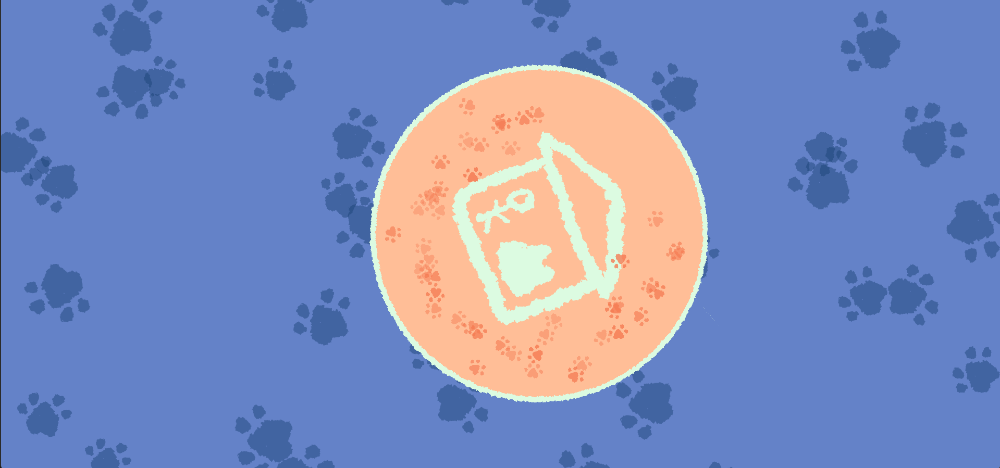
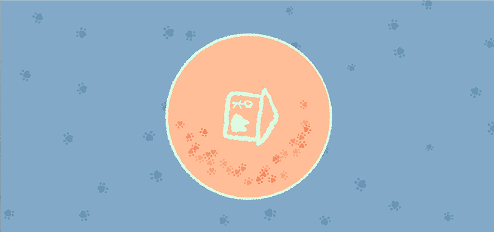
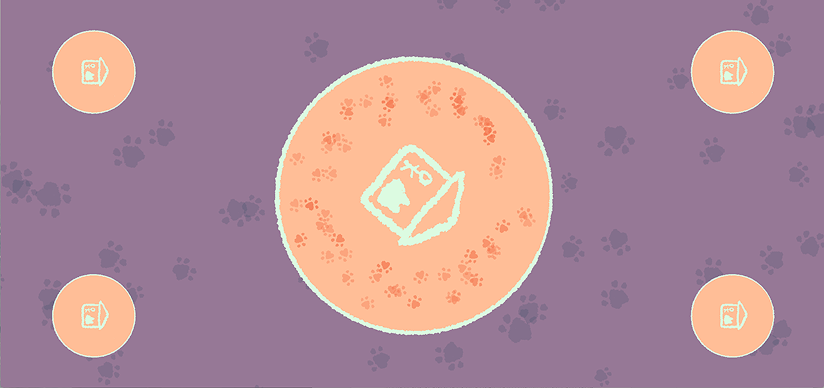
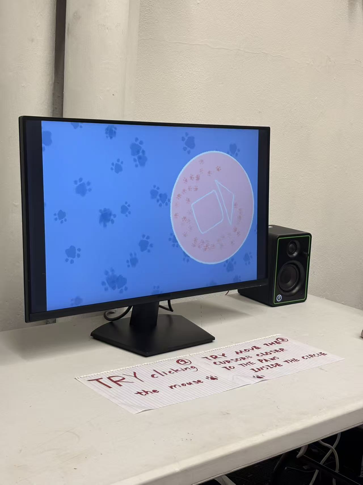

# PROJECT TITLE
PAW PAW
## Short Description
Pawpaw is an interactive visual work about separation anxiety, seen from a human perspective but projected onto a cat.

## Concept / Intent
Pawpaw explores the emotional experience of cats from a human perspective, focusing on the externalisation of feline separation anxiety. The central circular form represents the shared home of the cat and its owner. As the cat repeatedly walks around this space, it leaves pawprint trails that symbolise the long duration of waiting and emotional attachment.

The project also reflects the emotional projection of pet owners, suggesting that human separation anxiety is often mirrored onto domestic cats. This idea is informed by animal behaviour research, particularly John Bradshaw's Cat Sense (2013), which discusses how cats evolved from solitary animals into companions that form emotional bonds with humans. Peter Wohlleben's The Inner Life of Animals (2017) further supports the view that animals are capable of experiencing complex emotions such as anxiety, fear, and attachment. Academic research from Applied Animal Behaviour Science provides additional scientific context for understanding stress-related behaviours in domestic cats.

In terms of creative tradition, pawpaw is situated within interactive and generative art practices that visualise emotional states through repetition, motion, and sensory interaction. By translating non-human emotions into visual patterns and sound responses, the work aligns with computational art approaches that aim to create empathy and emotional resonance rather than literal representation.

## Technology Used
1.Project Process
This project started from a personal emotional observation. I followed a stray cat rescue blogger online. One of the rescued kittens showed strong symptoms of separation anxiety-she would stop eating or drinking and become depressed when her human was not around.I wanted to visualize this emotion from a human perspective. After researching articles and books about pet psychology and animal behavior, I learned that both cats and their owners can experience separation anxiety. This inspired me to build a scene of a kitten walking in circles at home, waiting for its owner.In the early stage, I experimented with generating cat paw shapes using code in p5.js. I created simple paw structures using circles. Then I added motion paths and visual layers to represent the cat's milk-kneading behavior (a comforting action cats do). Later, I replaced the digital paws with hand-drawn fuzzy paw images based on feedback from my tutor and peers.To reflect the emotional complexity, I divided the project into three mood stages: anxiety, restlessness, and loneliness. Each mood has its own color and background movement.
2.Technical Tools
I used p5.js as the main framework. The work uses basic canvas drawing, mouse position detection, and sound interaction.
All visual elements (paw prints, circles, home icon) are layered and animated. I also added a full-screen responsive design to support browser display.
3.Design Decisions
I chose a circular home in the center to represent the 'safe space' that cats usually associate with home. The paws looping inside show the emotional tension of waiting.
For interaction, I used mouse hover instead of clicking to trigger sounds. This was because hovering feels more like 'touching'-just like how we lightly pet a cat. I asked ChatGPT for support on implementing the hover logic with sound loop and stop based on mouse proximity.
In the background, I used moving paw prints rather than static ones, to reflect the constant emotional state of the kitten. Some prints shake or scale slightly to indicate emotional tension, such as trembling or milk-kneading.
I also set up randomized sound effects for paw interaction. This choice helps simulate the unpredictable emotions of cats. Later, I removed some overly sharp meowing sounds to maintain a soothing mood.
Finally, I added volume control for all audio elements. Sudden loud sounds might intensify anxiety for both cats and humans, so I lowered the levels carefully.

## How to Run / Install
Option 1: Open in Browser 

This project is built with p5.js
, and it runs directly in a modern web browser.
Click the link below to open the interactive version:
Try it on GitHub Pages:https://yanlili20200202-creator.github.io/pinUp/

Note: For best experience, use Chrome or Firefox on desktop.

Option 2: Run Locally in Browser

Download or clone this repo.
git clone https://yanlili20200202-creator.github.io/pinUp/
Open the index.html file in your browser.
No installation is needed. All scripts are included and browser-compatible.

Interaction Instructions

First you need a mouse.
Click anywhere on the canvas to switch moods
Hover your mouse near the paw prints in the central circle
Enjoy the visual and audio representation of the cat's emotions
The paw prints in the background are dynamic and reflect the cat's emotional state through movement.

## Requirements
No

## Screenshots / Media

## Credits / Acknowledgements
Bradshaw, J. (2013) Cat Sense: The Feline Enigma Revealed. Penguin Books, UK. Available at: https://www.penguin.co.uk/books/184558/cat-sense-by-bradshaw-john/9780241960455

Wohlleben, P. (2017) The Inner Life of Animals: Surprising Observations of a Hidden World. The Bodley Head / Vintage, UK. Available at: https://www.penguin.co.uk/books/433826/the-inner-life-of-animals-by-peter-wohlleben/9781784705954

Powell, L., Watson, B. and Serpell, J. (2023) 'Understanding feline feelings: An investigation of cat owners' perceptions of problematic cat behaviors', Applied Animal Behaviour Science, 266, 106025. doi:10.1016/j.applanim.2023.106025. Available at: https://doi.org/10.1016/j.applanim.2023.106025

Shiffman, D. (2016) The Coding Train: Circle Packing / Non-overlapping placement. YouTube. Available at:https://www.youtube.com/watch?v=QHEQuoIKgNE

Shiffman, D. (2018) The Nature of Code. Available at: https://natureofcode.com/

Reas, C. and Fry, B. (2014) Processing: A Programming Handbook for Visual Designers and Artists. 2nd edn. Cambridge, MA: The MIT Press. Available at: https://mitpress.mit.edu/9780262028288/processing/

p5.js (n.d.) Time. Available at: https://p5js.org/reference/#group-Time

p5.js (n.d.) Transform. Available at: https://p5js.org/reference/#group-Transform

## License
This project is licensed under the Creative Commons Attribution-NonCommercial 4.0 International License (CC BY-NC 4.0).

You are free to:
- Share and adapt the code and visual materials for non-commercial purposes

Under the following terms:
- Attribution: You must give appropriate credit to the original author.
- NonCommercial: You may not use the material for commercial purposes.

## Contact / Links
- GitHub Repository: https://yanlili20200202-creator.github.io/pinUp/
- Video: https://vimeo.com/1157368960?share=copy&fl=sv&fe=ci
- Contact: yanlili20200202@gmail.com
